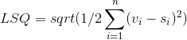
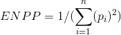

# Codebook Power Diffusion and Democracy

# How to cite 
Book: Bernauer, Julian and Adrian Vatter (2019). Power Diffusion and Democracy: Institutions, Deliberation and Outcomes. Cambridge: Cambridge University Press. 

Data: Cite the book, and add: Book: Bernauer, Julian and Adrian Vatter (YEAR): Power Diffusion and Democracy Data Repository, https://github.com/julianbernauer/powerdiffusion, [downloaded XX].

## Electoral disproportionality

- Variable label in the data set: *elec*
- Measurement level: *continuous*
- Varies by: *election*

Measured with the continuous Gallagher index of disproportionality, which compares parties' vote and seat shares at parliamentary elections (lower house), pronouncing stronger deviations more. The index LSQ considers the vote shares s and the seat shares v of parties i: 

Main source: Gallagher (2015), see the codebook provided there for details on the treatment of for instance the "other" category for electoral results (taken as a single party here) and other coding issues. Closely allied parties are treated as separate parties, umbrella or factionalized parties treated as single parties. Further elections in Ghana, Mongolia, Panama, Benin, Cape Verde, Mali, Taiwan and Uruguay are coded using sources such as the Interparliamentary Union (IPU), http://www.ipu.org and http://psephos.adam-carr.net, accessed in June 2013 and August 2015. Details on the coding are available from the authors. Missing values: Benin 2004-2015, Dominican Republic 1998-2001, South Korea 2009-2012, Mali 1998-2015 and Mongolia 1991. Lithuania 1991 and Poland 1990 are transitional cases, where the countries are coded as democratic, but not yet the elections.

## Effective number of parliamentary parties

- *Variable label in the data set: par* 
- *Measurement level: continuous*
- *Varies by: election*

A continuous variable computed using the formula by Laakso and Taagepera (1979), considering the relative size of parties. The number of parties ENPP equals the inverse sum of the squared seat shares s of parties i. Sources and missings: See electoral disproportionality, identical data base. 

## Cabinet type

- *Variable label in the data set: cab* 
- *Measurement level: ordinal*
- *Varies by: election*

Ordinal (election-level) contrast between one-party minimal winning (1), multi-party minimal winning (2), minority (3) and oversized (4) cabinets. Main source: Armingeon et al. (2012), covering 34 OECD countries. Presidential systems are coded as one-party minimal winning. The remaining countries are coded using the "Parliaments and governments database" (Döring and Manow 2015), http://www.parlgov.org and data from the Interparliamentary Union (IPU), http://www.ipu.org, both accessed in April 2015. Missing values: Caretaker governments in Belgium 2010-2011, Bulgaria 1993-1994, Czech Republic 2009-2010 and 2013, Italy 1996 and 2012-2013 as well as in the Netherlands 2010. Data missing for Mali 2012-2013. 

## Legislative power
- *Variable label in the data set: exeleg*
- *Measurement level: quasi-continuous*
- *Varies by: country*

A quasi-continuous variable and an adjusted variant of the expert-survey based data from Fish and Kroenig (2009), accessed via the Quality of Government Data Set (Teorell et al. 2015). Measured cross-sectional in 2007. Data for seven countries are missing due to their low population size, leading to the exclusion from the survey: Bahamas, Barbados, Cape Verde, Iceland, Luxembourg, Malta and Suriname. In detail, the original index is the sum of 32 binary survey items measuring the powers of parliaments (where 1 equals more power of the legislature) in the areas influence over the executive, institutional autonomy, specified powers and institutional capacities, which are divided by the total of items. The adjustments made give equal weight to formal general powers (influence over the executive and institutional autonomy) and institutional capacities. The item "judicial review" is removed from institutional autonomy, as it is a separate variable in our analysis. The area "specific powers" is excluded as it measures powers of parliament which are captured by other variables in our analysis (such as constitutional rigidity) or factors beyond the more general formal powers and informal capacities we are interested in (such as involvement in the signing of international treaties). The formula for our modified index is: [0.25 x mean item score influence over the executive + 0.25 x mean item score (modified) institutional autonomy + 0.50 x mean item score institutional capacities]. 

## Constitutional federalism
- *Variable label in the data set: fed* 
- *Measurement level: ordinal*
- *Varies by: country (largely)*

A three-category ordinal variable, ranging from "unitary" (1) to "semi-federal" (2) and "federal" (3) states. Main sources: 36 countries covered in Lijphart (2012: 178). The other 25 countries coded using Lundell and Karvonen (2003), reversing the scale in the database. Cross-checks using Armingeon et al. (2012). Dominican Republic coded as unitary. 

## Fiscal decentralization
- *Variable label in the data set: dec* 
- *Measurement level: continuous*
- *Varies by: yearly*

A continuous measure of the sub-national share in total tax revenues. Data entered using a hierarchy of sources: 1) For OECD countries Armingeon et al. (2014), 2) in particular for some central and eastern European countries Vatter and Bernauer (2011), 3) Database of Political Institutions (DPI, accessed via Teorell et al. 2015), for a few more country-years 4) additional data provided by the World Bank, http://www1.worldbank.org/publicsector/decentralization/fiscalindicators.htm, accessed January 21, 2013, and 4) Austria: "Gebarungsübersichten" via http://www.statistik.at/web_de/statistiken/index.html, accessed in April 2016. Comparatively many, and according to the World Bank potentially systematical, missing values. No data for Bahamas, Barbados, Cape Verde, Ghana, Jamaica, Mali, Namibia, Suriname, Taiwan and Uruguay. No data available after 2012. Single years missing: Bulgaria 1991-1994, Croatia 2001, Estonia 1993-1994, Hungary 1990, Latvia 1994, Lithuania 1991-1994 and Slovenia 1991. Spotty available data: Benin only old proxy (from seventies) inserted for 1991, Botswana only 1990 and 1994, El Salvador only old proxy (seventies) inserted for 1997, Korea old proxy (seventies) inserted for 1990 and data available for 1997-2002 as well as 2006, Malta only 1995-2003 and Panama only 1994. Cross-section from the DPI around 2000 available for a number of countries, entered for this year only in the case of Argentina, Costa Rica, Dominican Republic, India, Mauritius, Mexico, Mongolia, South Africa as well as Trinidad and Tobago. Chile and Israel: Only 1997-2006 covered.

## Bicameralism
- *Variable label in the data set: bic*
- *Measurement level: ordinal*
- *Varies by: country (largely)*

A four-fold ordinal classification by power symmetry and partisan congruence, with "no bicameralism" (1), "weak bicameralism" (2), "medium bicameralism" (3) and "strong bicameralism" (4). Main source: Armingeon et al. (2014). Values for Chile, Poland, Mexico, Taiwan and South Korea taken from Vatter and Bernauer (2011). Belgium from 1995 on (reform), Norway from 2009 on (reform), Argentina, Bahamas, Barbados, Costa Rica, India, Jamaica and Uruguay coded from Lijphart (2012). Benin, Botswana, Cape Verde, Croatia, Dominican Republic, El Salvador, Ghana, Mauritius, Mongolia, Namibia, Panama, South Africa, Suriname, Trinidad and Tobago as well as Mali coded relying on Lundell and Karvonen (2003). 
Constitutional rigidity, variable label const in the data set, is a three-category ordinal index of the required majorities for change, ranging from "low" (1) over "medium" (2) to "high" (3).  Source: Rescaled version of Siaroff (2009: 218). Siaroff (2009: 223) states that "[...] countries are scored 2 (high) where, in addition to legislative approval, constitutional amendments must pass in a referendum with a supermajority (overall and regionally) or that also requires approval from a supermajority of regions. Countries are scored 0 (low) where only legislative approval - indeed, only with a basic majority and not a supermajority - is needed for constitutional change. This holds even if an intervening election is required. Finally, countries are scored 1 (moderate) for all other cases, normally involving either a threshold of greater than 50 per cent plus one in the legislature or a national referendum (but with no double majority or supermajority) to amend the constitution." 

## Judical review
- *Variable label in the data set: jud* 
- *Measurement level: ordinal*
- *Varies by: country*

A three-category ordinal variable ranging from "no or little" (1) to "medium strength" (2) and "strong" (3) review. Sources: Hierarchy of 1) 36 countries coded using Lijphart (2012: 215), with categories 0 (no judicial review) and 1 (weak judicial review) collapsed into category 1 (no or weak judicial review) following Siaroff (2009: 217), 2) the following countries added using Vatter and Bernauer (2011): Bulgaria, Czech Republic, Estonia,  Hungary, Latvia, Lithuania, Poland, Romania, Slovakia, Slovenia, Taiwan, Mexico and Chile and 3) further countries added from Siaroff (2009: 218): Benin, Cape Verde, Croatia, El Salvador, Mali, Mongolia, Namibia, Ghana, Dominican Republic, Panama, South Africa and Suriname.

## Presidentialism
- *Variable label in the data set: pres* 
- *Measurement level: ordinal*
- *Varies by: country*

Classification into presidential (3), semi-presidential (2) and parliamentary (1) systems. Sources: Mainly Cheibub, Gandhi, and Vreeland (2009), accessed via Teorell et al. (2015), cross-checks and recoding using in particular Lijphart (2012) and Schmidt (2010). The actual strength of presidentialism is coded rather than the nominal presidential character of a country. In particular, South Africa, Iceland, Ireland, Bulgaria, Slovakia, Slovenia and Austria are coded as parliamentary democracies despite of some nominal presidential elements. Switzerland's hybrid system of a collective executive elected by but independent from parliament is coded as semi-presidential. 

## Direct democracy
- *Variable label in the data set: dir*
- *Measurement level: qusi-continuous*
- *Varies by: country (largely)*

Approximately continuous index of direct democratic power dispersion (initiatives and referendums). Sources: Our own calculations are mainly based on data from the Centre for Research on Direct Democracy (C2D), Zurich, http://www.c2d.ch/ and the IRI/DI Navigator to Direct Democracy, http://direct-democracy-navigator.org/countries, both accessed repeatedly in June 2013. Usage coded for 1990-2010. Cross-checks using various sources. See below for details. The index compiled contains points for the degree of majoritarianism or consensualism in the direct democratic provisions in the constitution and embodied in the decision rules as well as for the actual use of direct democracy. "Uncontrolled" referendums, i.e. optional referendums and initiatives score 1 point each if prescribed by the constitution. Plebiscites (ad hoc referendums), which are subject to the discretion of the head of governments score a negative point each if prescribed by the constitution. As an intermediate form, 0 points are given for mandatory referendums. 0.5 points awarded for each variant of direct democracy when a quorum of participation is required and 1 point when a qualified majority is required. 1 point is awarded for the actual use of mandatory referendums, optional referendums and popular initiatives, and a negative point for the use of plebiscites.

